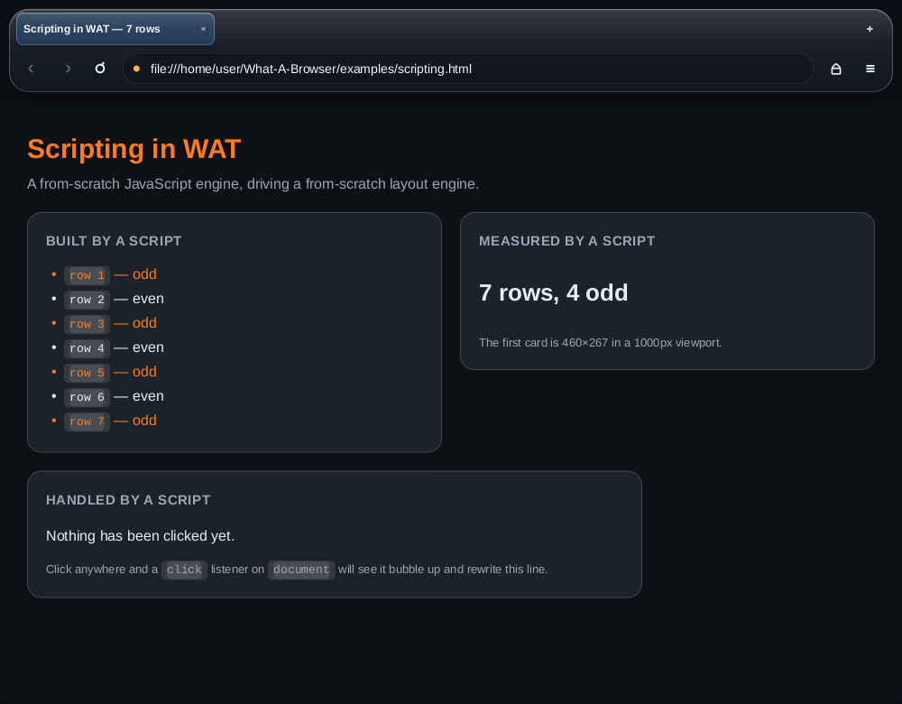

# What-A-Browser (WAT)

An open-source web browser for desktop and mobile, built on its own engine.

Not a Chromium wrapper. Not a Firefox fork. The HTML parser, CSS engine, layout
engine, text stack, rasterizer and JavaScript engine in this repository are all
written from scratch in Rust, and the interface is themed by a file you can
edit.

The default theme is **Liquid Glass**.


## The glass is real

`backdrop-filter` is implemented in the rasterizer, so translucent surfaces
actually blur and saturate the pixels behind them — both in the browser chrome
and on the pages you visit. This is `examples/glass.html`, rendered by the
engine in this repository:


## Two layouts from one codebase

The chrome has a desktop layout and a touch layout and picks between them by
width, so the same engine draws both. It is the Android app that ships it now —
the desktop application was removed, and the PC browser is a Firefox fork; see
below.

| Desktop, dark | Mobile, dark |
| --- | --- |
|  |  |

## Getting started

Rust 1.82 or newer is the only prerequisite.

```sh
git clone https://github.com/ellosan/what-a-browser
cd what-a-browser
cargo test --workspace          # 827 tests, no network required
cargo run --release --example frame_bench -p wat-shell
```

There is no `wat` binary any more. The engine is a set of libraries, and the
things that used to be CLI commands are examples that render to PNG:

```sh
# A window, and how long a frame takes at three sizes
cargo run --release --example frame_bench -p wat-shell

# A cold start, phone-sized, with boot-preview.png and boot-full.png written out
cargo run --release --example boot_bench -p wat-shell

# The launcher icons, drawn with the browser's own rasterizer
cargo run --release --example app_icon -p wat-paint -- android-webview/app/src/main/res
```

To run the browser, build one of the apps: `android/` for WAT's own engine,
`android-webview/` for the everyday browser, `firefox/` for the PC fork.

## Fully customizable

The whole interface is described by a TOML file — colours, corner radii,
spacing, control sizes, fonts, motion, and every parameter of the glass. Because
every field has a default, a theme only lists what it changes:

```toml
name = "Liquid Glass (warm)"

[light.palette]
accent = "#ff7a1a"

[light.glass]
blur = 34.0
saturation = 2.0
sheen = 0.45
```

```sh
wat --theme warm.toml
```

Turning the glass off is a theme, not a code path — the same widgets become flat
and opaque:


Four themes ship with the browser: `liquid-glass`, `liquid-glass-dark`,
`liquid-glass-graphite` and `flat`. `docs/THEMING.md` documents every field.

## What is actually implemented

* **HTML** — tokenizer and tree builder, character references, raw-text
  elements, implied tags, error recovery.
* **CSS** — tokenizer, selector engine (combinators, attribute selectors,
  structural and functional pseudo-classes), specificity and the full cascade
  across user-agent, user and author origins with `!important`, media queries,
  `@import`, inline styles, presentational attributes, custom properties with
  `var()` and fallbacks, `calc()`/`min()`/`max()`/`clamp()`, and ~150
  properties.
* **JavaScript** — a lexer, a recursive-descent parser and a tree-walking
  interpreter: closures, classes with inheritance and `super`, `get`/`set`
  accessors, `#private` fields, destructuring, template literals, spread,
  optional chaining, `try`/`catch`/`finally`, and built-ins for `console`,
  `Math`, `JSON`, `Object`, `Array`, `String`, `Number`, `Date`, the error
  types and timers.
* **The DOM** — `document` lookups and creation, `textContent`, `innerHTML`,
  attributes, `classList`, inline `style` as properties, tree editing,
  `getBoundingClientRect`, `addEventListener` with bubbling and
  `preventDefault`, inline `on…` handlers, `window`, `location` and
  `navigator`. A script that changes the page gets it restyled, laid out and
  repainted.
* **Layout** — block and inline formatting contexts with real line breaking,
  margin collapsing, flexbox (grow, shrink, wrap, `justify-content`,
  `align-items`, both directions), a single-axis grid, absolute and fixed
  positioning, `min`/`max` sizing, `box-sizing`, replaced-element sizing,
  overflow and scrolling.
* **Text** — system font discovery, family matching with fallback, kerning,
  glyph rasterization and caching.
* **Painting** — a software rasterizer using signed distance fields for
  antialiasing: rounded rectangles, per-side borders, gradients, inner and outer
  shadows, opacity groups, clipping, images, and a separable blur that
  implements `backdrop-filter`.
* **Networking** — `http`, `https`, `file` (including directory listings),
  `data` and `about` URLs, redirects, content sniffing, proxy support, an LRU
  cache.
* **Browser** — tabs, per-tab history, an omnibox that tells addresses from
  searches, hover and cursor feedback, themed internal pages.

## Scripts run

The JavaScript engine is written from scratch for the same reason as everything
else here: the whole path from source text to repainted pixel stays readable.
A page's scripts run after it is parsed, and anything they change is restyled,
laid out and repainted:

```html
<button id="add">Add a row</button>
<ul id="list"></ul>
<script>
  document.getElementById('add').addEventListener('click', () => {
    const item = document.createElement('li');
    item.textContent = `row ${document.querySelectorAll('li').length + 1}`;
    item.classList.add('fresh');
    document.getElementById('list').appendChild(item);
  });
</script>
```

Two limits are enforced on every run, because page scripts share a thread with
the browser's own interface: a step budget and a maximum call depth. A runaway
loop stops in well under a second and cannot be caught by the page, so a bad
script spoils its own page and nothing else.



That page is `examples/scripting.html`, rendered by this repository. Everything
in the two upper cards was created by the script — including the measurement,
which is the real layout.

`docs/JAVASCRIPT.md` covers what the engine supports, what it does not, and how
to embed it.

## What is not

Being clear about this matters more than the feature list:

* **JavaScript has no regular expressions, promises, `async`/`await`,
  generators, `Symbol`, `Proxy` or `Map`/`Set`.** There is no `fetch`, no
  `XMLHttpRequest`, no storage and no `getComputedStyle`, so a page that loads
  its content over the network after rendering will stay empty. A script that
  runs too long or recurses too deep is stopped rather than hanging the
  browser.
* **Tables** are approximated by treating rows as flex lines rather than running
  the table sizing algorithm.
* **Floats** are parsed but not laid out around; a floated box behaves as a
  block.
* **Grid** supports `grid-template-columns` and gaps; areas, explicit placement
  and row templates are not implemented.
* **`transform`** applies translation only; scale and rotation are ignored when
  painting page content.
* **HiDPI** scaling is not applied — the window renders at one device pixel per
  CSS pixel.
* No video or audio playback, no WebAssembly, no service workers, no extensions.

`docs/ARCHITECTURE.md` lists the deviations from the specifications in detail.

## Layout of the repository

| Crate | What it does |
| --- | --- |
| `wat-dom` | Arena-backed DOM, serialization |
| `wat-html` | HTML tokenizer and tree builder |
| `wat-css` | CSS tokenizer, values, colours, selectors, media queries, `calc()`, parser |
| `wat-style` | Computed styles, the cascade, the user-agent stylesheet |
| `wat-js` | The JavaScript engine: lexer, parser, interpreter, built-ins |
| `wat-script` | DOM bindings and event dispatch, joining the two |
| `wat-text` | Font discovery, metrics, shaping, glyph rasterization |
| `wat-layout` | Box tree, block/inline/flex/grid layout, hit testing |
| `wat-paint` | Display lists and the software rasterizer |
| `wat-net` | URLs, schemes, resource loading, caching |
| `wat-engine` | The pipeline, tabs, history, internal pages |
| `wat-theme` | The theme model and the bundled presets |
| `wat-ui` | The adaptive Liquid Glass chrome |
| `wat-shell` | Window and event loop, desktop and Android entry points, touch |

```sh
cargo test --workspace   # 850+ tests, no network required
cargo clippy --workspace --all-targets
```

## The PC browser: a Firefox fork

`firefox/` is where the desktop browser lives now. The one that used to be
here — WAT's own engine in a winit window, driven by a `wat` binary — has been
removed, and the PC story is a patched Firefox instead: Gecko and its sandbox,
WAT's look, and none of the compatibility gap a from-scratch engine has on the
real web.

It is **scaffolding, not a build**: a version pin, the fetch/build/rebase
scripts, a mozconfig with telemetry and crash reporting off, and an honest list
of the patches that are not written yet. Same shape as `chromium/`, and the same
warning applies — a fork's security is its rebase cadence and nothing else.

Gecko has no embedding API, so a fork is the only thing "on Firefox" can mean.
See [firefox/README.md](firefox/README.md).

## Android on the system WebView

`android-webview/` is the third option: Chromium's engine through Android's
system WebView and WAT's interface around it. Google patches
the engine through Play, so it cannot fall behind the way a fork can. No
extensions, and no engine control.

It is an everyday browser: tabs, bookmarks, history, downloads, file uploads,
find in page, sharing, desktop sites, fullscreen video and a settings screen in
Chrome's shape with more privacy in it than Chrome offers — tracker blocking on
by default, refuse-all-cookies, clear-everything-on-exit — and userscripts
instead of extensions, since a WebView can host the second honestly and not the
first. Only
three tabs holding a live `WebView` at a time, because a phone with 4 GB in it
cannot afford sixteen.

Private browsing comes in two: **hiding cat**, which writes nothing down, and
**hiding lion**, which is hiding cat with every request through Tor. Tor is
carried in the app the way desktop Brave carries it — nothing else to install —
and the window refuses to open until `check.torproject.org` has confirmed, through
that same proxied WebView, that Tor is what it sees. Each runs in a process of its
own, because Android's WebView keeps one cookie jar per process and that is the
only thing that makes a private window actually separate. The Tor window is not
the Tor Browser and says so before the first page.

The glass is real glass: the strip of page behind each bar is captured at an
eighth scale, blurred, bent inward at the edges the way a thick pane refracts,
and drawn as the bar's backdrop — with a specular highlight that slides as the
phone tilts, and a brightening where a finger lands. The launcher icon is drawn
by `wat-paint`, the same rasterizer that draws the browser. See
[docs/WEBVIEW.md](docs/WEBVIEW.md) for what is hardened, what Android cannot do,
and why.

## Android on a Chromium fork

`chromium/` builds the Android browser from a patched Chromium instead of WAT's
own engine — Chromium's engine and sandbox, WAT's look, and the extensions Chrome
for Android does not have. It is pinned to a Chromium release, carries a small
patch series, and is **unbuilt**: see [docs](chromium/README.md) for what that
means and for the rebase duty a fork commits you to.

## Android on WAT's own engine

There is a real Android app in `android/`, and it is the same browser: no Java
beyond a manifest, no WebView. `NativeActivity` loads `libwat_shell.so` and
everything from the HTML parser to the rasterizer is the Rust in `crates/`.

```sh
cargo install cargo-ndk
rustup target add aarch64-linux-android armv7-linux-androideabi \
    i686-linux-android x86_64-linux-android
export ANDROID_HOME=$HOME/Android/Sdk
export ANDROID_NDK_HOME=$ANDROID_HOME/ndk/27.0.12077973

./android/build.sh                 # debug APK, all four ABIs
./android/build.sh release         # 4.6 MB, unsigned
```

A whole browser engine in a 4.6 MB APK, because there is no engine to bundle —
it is the app.

Making the desktop shell work on a phone took four things, not a port: laying
out in CSS pixels and rasterizing at the device pixel ratio, a touch model where
a drag scrolls and only a finger that stayed put taps, the back gesture going
back in history, and loading `/system/fonts`, which `fontdb` does not do.
`docs/ANDROID.md` covers all of it.

**It has not been run on a device.** It compiles for every ABI, exports the
right symbols and assembles into an installable APK — but nobody has held it.

**iOS** — winit drives UIKit, so `wat_shell::run` works from an Xcode project's
`main`. That one really is just a starting point.

## Contributing

Issues and pull requests are welcome. `cargo test --workspace` must pass, and
new behaviour needs tests — the engine is only trustworthy because it is covered.
Keeping the public surface documented matters too: every crate's `lib.rs`
explains what it is for.

## Licence

MIT. See [LICENSE](LICENSE).
