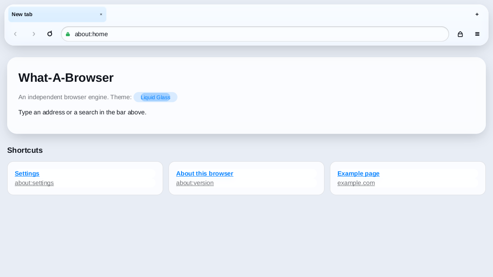
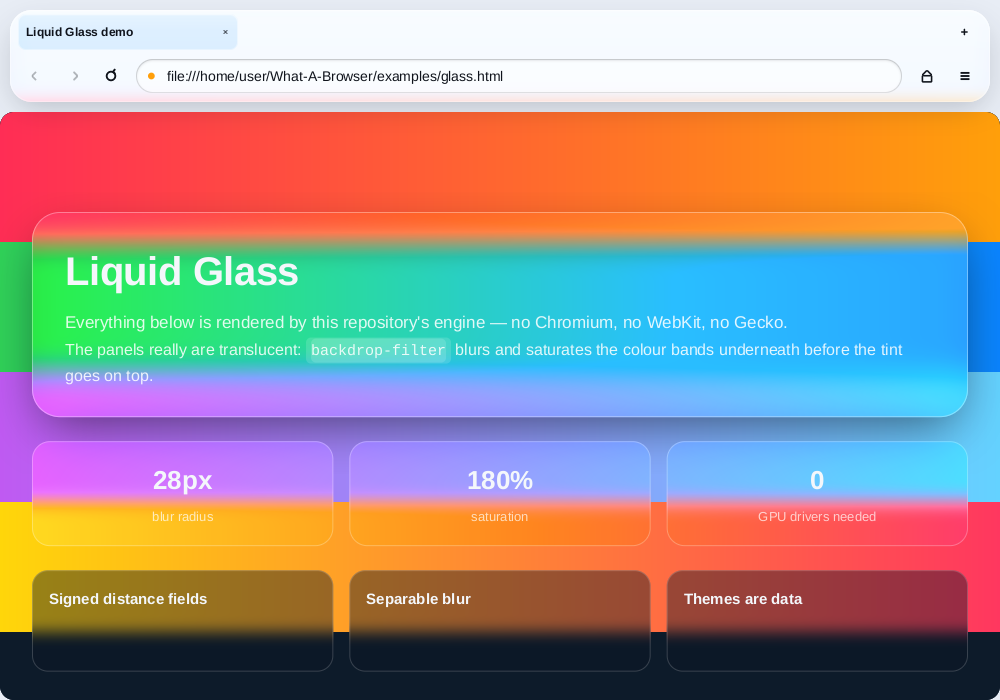
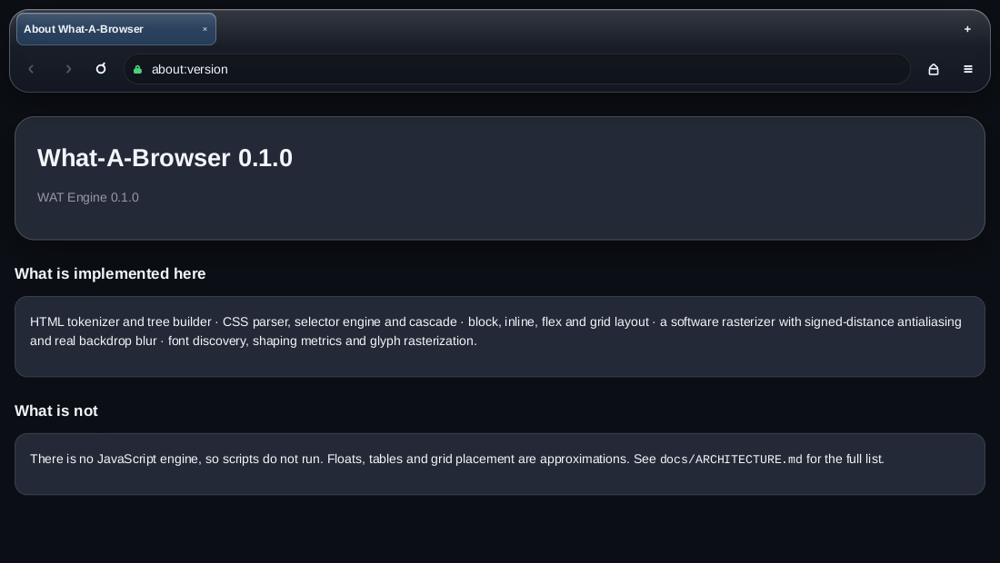
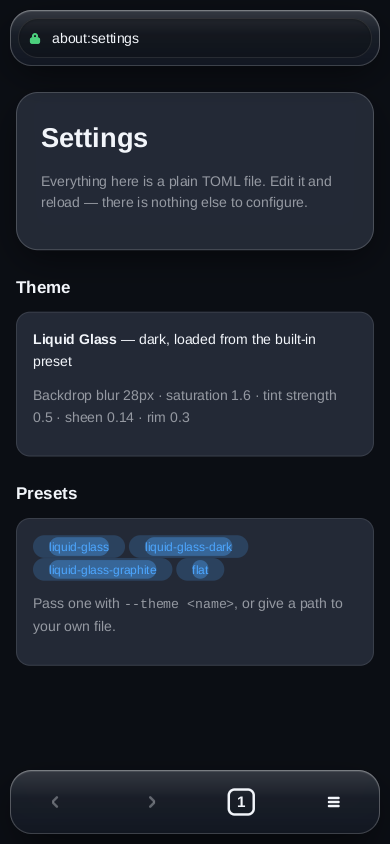
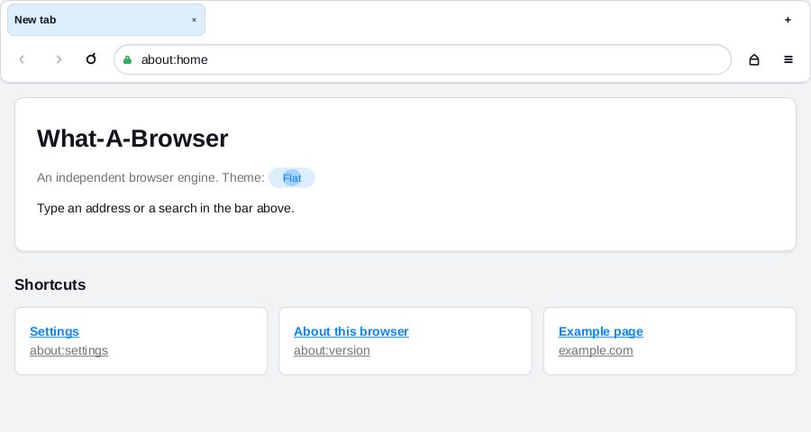

# What-A-Browser (WAT)

An open-source web browser for desktop and mobile, built on its own engine.

Not a Chromium wrapper. Not a Firefox fork. The HTML parser, CSS engine, layout
engine, text stack and rasterizer in this repository are written from scratch in
Rust, and the interface is themed by a file you can edit.

The default theme is **Liquid Glass**.



## The glass is real

`backdrop-filter` is implemented in the rasterizer, so translucent surfaces
actually blur and saturate the pixels behind them — both in the browser chrome
and on the pages you visit. This is `examples/glass.html`, rendered by the
engine in this repository:



## Desktop and mobile from one codebase

The chrome has two layouts and picks between them by window width, so the same
binary is a desktop browser and a phone browser. Resize a desktop window past
640px and it becomes the touch layout.

| Desktop, dark | Mobile, dark |
| --- | --- |
|  |  |

## Getting started

Rust 1.82 or newer is the only prerequisite.

```sh
git clone https://github.com/ellosan/what-a-browser
cd what-a-browser
cargo run --release
```

That opens a window. Everything the window does is also available headlessly,
which is handy over SSH and essential in CI:

```sh
# Render a whole browser window to a PNG
cargo run --release -- shot https://example.com -o example.png

# Render only the page
cargo run --release -- render https://example.com -o page.png

# The phone layout, dark
cargo run --release -- shot https://example.com --mobile --dark -o phone.png

# Inspect what the engine built
cargo run --release -- dom   https://example.com
cargo run --release -- boxes https://example.com --width 480
cargo run --release -- style https://example.com h1

# Themes
cargo run --release -- theme list
cargo run --release -- theme show liquid-glass > my-theme.toml
cargo run --release -- shot about:home --theme my-theme.toml -o custom.png
```

`wat help` lists every command and option.

### Keyboard

| Keys | Action |
| --- | --- |
| `Ctrl/Cmd + L`, `/` | Focus the address bar |
| `Ctrl/Cmd + T` / `W` | New tab / close tab |
| `Ctrl/Cmd + R`, `F5` | Reload |
| `Ctrl/Cmd + ←` / `→` | Back / forward |
| `Ctrl/Cmd + 1…9` | Select a tab |
| `Ctrl/Cmd + D` | Switch between light and dark |
| `Space`, `PgUp/PgDn`, `Home/End` | Scroll |

## Fully customizable

The whole interface is described by a TOML file — colours, corner radii,
spacing, control sizes, fonts, motion, and every parameter of the glass. Because
every field has a default, a theme only lists what it changes:

```toml
name = "Liquid Glass (warm)"

[light.palette]
accent = "#ff7a1a"

[light.glass]
blur = 34.0
saturation = 2.0
sheen = 0.45
```

```sh
wat --theme warm.toml
```

Turning the glass off is a theme, not a code path — the same widgets become flat
and opaque:



Four themes ship with the browser: `liquid-glass`, `liquid-glass-dark`,
`liquid-glass-graphite` and `flat`. `docs/THEMING.md` documents every field.

## What is actually implemented

* **HTML** — tokenizer and tree builder, character references, raw-text
  elements, implied tags, error recovery.
* **CSS** — tokenizer, selector engine (combinators, attribute selectors,
  structural and functional pseudo-classes), specificity and the full cascade
  across user-agent, user and author origins with `!important`, media queries,
  `@import`, inline styles, presentational attributes, and ~150 properties.
* **Layout** — block and inline formatting contexts with real line breaking,
  margin collapsing, flexbox (grow, shrink, wrap, `justify-content`,
  `align-items`, both directions), a single-axis grid, absolute and fixed
  positioning, `min`/`max` sizing, `box-sizing`, replaced-element sizing,
  overflow and scrolling.
* **Text** — system font discovery, family matching with fallback, kerning,
  glyph rasterization and caching.
* **Painting** — a software rasterizer using signed distance fields for
  antialiasing: rounded rectangles, per-side borders, gradients, inner and outer
  shadows, opacity groups, clipping, images, and a separable blur that
  implements `backdrop-filter`.
* **Networking** — `http`, `https`, `file` (including directory listings),
  `data` and `about` URLs, redirects, content sniffing, proxy support, an LRU
  cache.
* **Browser** — tabs, per-tab history, an omnibox that tells addresses from
  searches, hover and cursor feedback, themed internal pages.

## What is not

Being clear about this matters more than the feature list:

* **There is no JavaScript engine.** Scripts are parsed and ignored. Pages that
  render entirely from JavaScript will show an empty document.
* **Tables** are approximated by treating rows as flex lines rather than running
  the table sizing algorithm.
* **Floats** are parsed but not laid out around; a floated box behaves as a
  block.
* **Grid** supports `grid-template-columns` and gaps; areas, explicit placement
  and row templates are not implemented.
* **`transform`** applies translation only; scale and rotation are ignored when
  painting page content.
* **HiDPI** scaling is not applied — the window renders at one device pixel per
  CSS pixel.
* No video or audio playback, no WebAssembly, no service workers, no extensions.

`docs/ARCHITECTURE.md` lists the deviations from the specifications in detail.

## Layout of the repository

| Crate | What it does |
| --- | --- |
| `wat-dom` | Arena-backed DOM, serialization |
| `wat-html` | HTML tokenizer and tree builder |
| `wat-css` | CSS tokenizer, values, colours, selectors, media queries, parser |
| `wat-style` | Computed styles, the cascade, the user-agent stylesheet |
| `wat-text` | Font discovery, metrics, shaping, glyph rasterization |
| `wat-layout` | Box tree, block/inline/flex/grid layout, hit testing |
| `wat-paint` | Display lists and the software rasterizer |
| `wat-net` | URLs, schemes, resource loading, caching |
| `wat-engine` | The pipeline, tabs, history, internal pages |
| `wat-theme` | The theme model and the bundled presets |
| `wat-ui` | The adaptive Liquid Glass chrome |
| `wat-shell` | Window and event loop, desktop and Android entry points |
| `wat-cli` | The `wat` binary |

```sh
cargo test --workspace   # 550+ tests, no network required
cargo clippy --workspace --all-targets
```

## Mobile builds

The chrome, engine and rasterizer are platform-independent; only `wat-shell`
touches the window system.

* **Android** — `wat-shell` exports `android_main` when built for an Android
  target, using winit's native-activity backend. Build the shared library with
  `cargo-ndk` and package it with an ordinary activity.
* **iOS** — winit drives UIKit, so `wat_shell::run` works from an Xcode project's
  `main`.

Both entry points are wired up and compile, but have not been exercised on a
device; treat them as a starting point rather than a shipping app.

## Contributing

Issues and pull requests are welcome. `cargo test --workspace` must pass, and
new behaviour needs tests — the engine is only trustworthy because it is covered.
Keeping the public surface documented matters too: every crate's `lib.rs`
explains what it is for.

## Licence

MIT. See [LICENSE](LICENSE).
